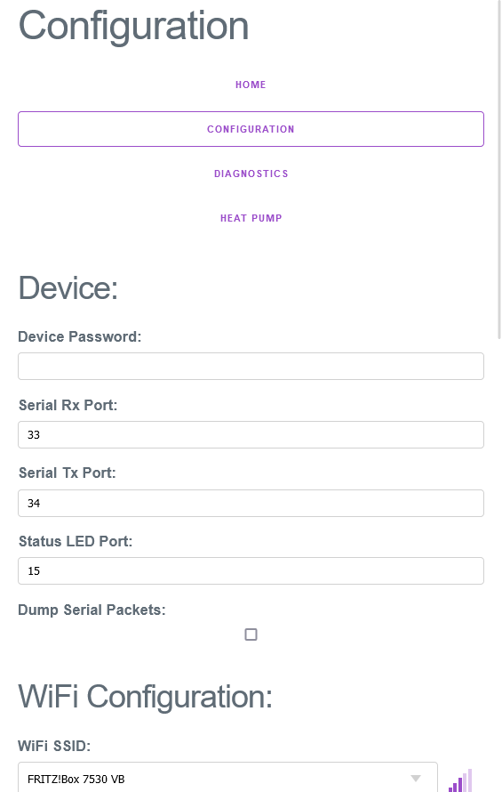
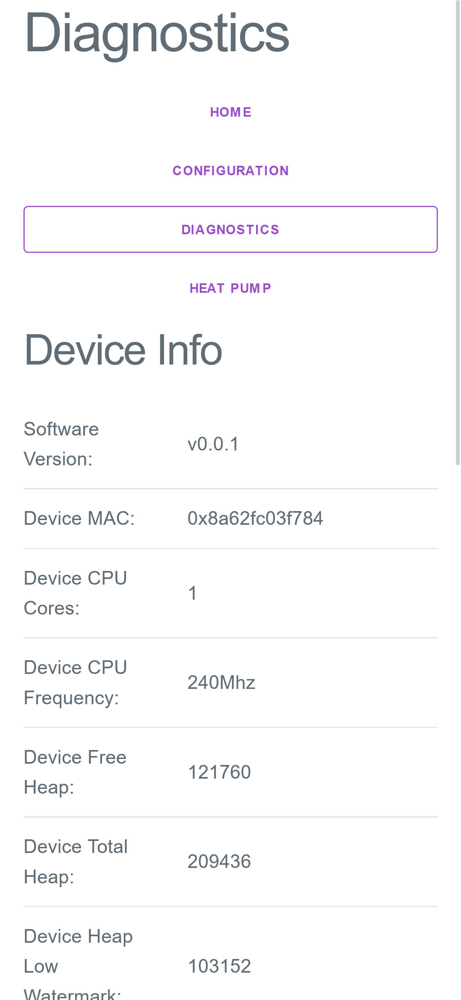
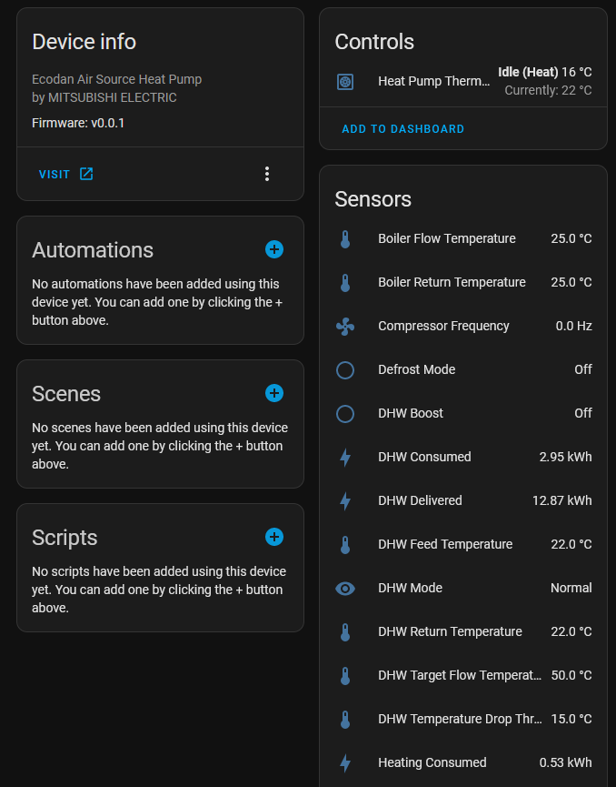

# ecodan-ha-local
ESP32 compatible program for local monitoring of Mitsubishi Ecodan Air to Water heat pumps.

Uses the CN105 connector on the Cased Flow Temp Controller (FTC6 in my setup) to control + monitor the heat pump.

There are a number of existing solutions for connecting to Mitsubish heat pump models via the CN105 connector, though I couldn't find any which were tailored towards air-to-water heat pumps rather than the more common air-to-air versions.

  
  

## Hardware Dependencies
- ESP32-compatible development board (I'm using a generic ESP32S2 Dev Module)
- CN105 female connector + pigtails, as described [here](https://github.com/SwiCago/HeatPump#Demo-Circuit).

## Library Dependencies
- ArduinoJson v6.21.2
- Seeed_Arduino_mdedtls v3.0.1
- PubSubClient v2.8

## First Time Setup
- Clone this repository and build with the Arduino IDE
- Flash the image to the ESP32 board
- Take the board out of firmware update mode, and it should broadcast a wireless network called `ecodan_ha_local`, connect to this network
- Configure the device to match your setup (see [Software Configuration](#Software-Configuration))

## Deploying Updates
After initial flashing + configuration is completed, it's possible to update the firmware over your WiFi network by:
- Building the firmware binary with: `Sketch > Export Compiled Binary`
- Visit the configuration page for your device, by default this will be: [http://ecodan-ha-local/configuration](http://ecodan-ha-local/configuration)
- Scroll down to the Firmware Update section at the bottom of the configuration page
- Select the firmware binary which should be inside a folder such as `build\esp32.esp32.esp32s2\ecodan-ha-local.ino.bin` under `Sketch > Show Sketch Folder`
- Hit the "Update" button, the firmware update should proceed, and load back to the home page when completed

## Software Configuration

### Device Password
Setting a device password will cause the web interface to require the password to be specified each time the board is booted, or the client's browser cookies are cleared.

It's strongly recommended to enable this setting in case the device falls back to broadcasting an open access point, as it will retain other configuration values (MQTT passwords, server, Wifi SSID/Password) which may then be readable by anyone.

*Default*: `""`

*Required*: No

### Serial Rx Port
The GPIO pin number which should be used for Serial data receive.

*Default*: `33`

*Required*: Yes

### Serial Tx Port
The GPIO pin number which should be used for Serial data transmit.

*Default*: `34`

*Required*: Yes

### WiFi SSID
The SSID of the WiFi network which you'd like the device to connect to. When the diagnostics page is loaded, the device will automatically initiate a scan for available WiFi networks and populate the menu when it completes.

Note: If this setting or "WiFi Password" are unset, the device will continue to boot into a captive portal access point.

*Default*: `""`

*Required*: Yes

### WiFi Password
The passphrase/password which should be used when connecting to the previously specified WiFi SSID.

Note: If this setting or "WiFi SSID" are unset, the device will continue to boot into a captive portal access point.

*Default*: `""`

*Required*: Yes

### Hostname
The network hostname the device will use to identify itself. 

*Default*: `ecodan_ha_local`

*Required*: No

### MQTT Server
The IP address or hostname of the MQTT server on your local network.

*Default*: `""`

*Required*: Yes

### MQTT Port
The port on which your MQTT server is listening. 

*Default*: `1883`

*Required*: Yes

### MQTT User
The username which should be used when connecting to the specified MQTT Server.

*Default*: `""`

*Required*: Yes

### MQTT Password
The password for the given MQTT User.

*Default*: `""`

*Required*: Yes

### MQTT Topic
The topic value which the server should use to filter messages related to this heat pump.

*Default*: `ecodan_hp`

*Required*: Yes

